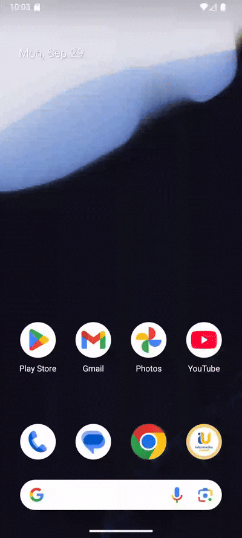

# Tugas Pemrograman Mobile

## Identitas
- Nama  : Firyal Aufa Fahrudin
- NIM   : H1D023018
- Shift : B/F

---
## Tugas 1 Pertemuan 2
Berikut adalah hasil tugas pertemuan 2:

- Screenshot aplikasi (halaman utama)  
  

## Tugas 2 Pertemuan 3
Berikut adalah demo aplikasi yang memperlihatkan perpindahan halaman:

<video src="https://github.com/aoefiles/Tugas2-Pertemuan3/raw/main/ProfilLulusan.webm"
       controls
       width="480">
</video>

Atau klik link di bawah:
[🎥 Lihat demo ProfilLulusan.webm](https://github.com/aoefiles/Tugas2-Pertemuan3/raw/main/ProfilLulusan.webm)

## Tugas 3 Pertemuan 4

Demo aplikasi memperlihatkan tampilan data yang didapat:

## Tugas 4 Pertemuan 5

Berikut adalah hasil demo aplikasi pada pertemuan 5 yang menampilkan flow dari halaman pertama menuju halaman selanjutnya serta modal info dari buku yang ada:

